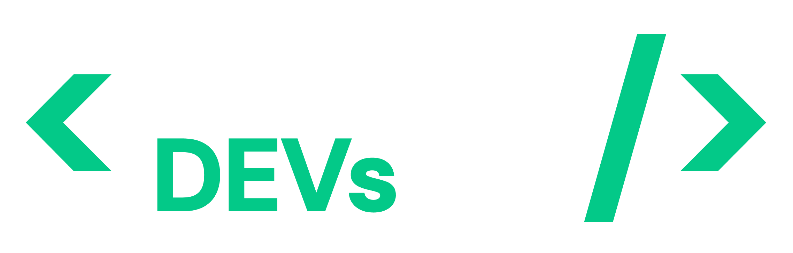

<!-- Improved compatibility of back to top link: See: https://github.com/othneildrew/Best-README-Template/pull/73 -->
<a id="readme-top"></a>
<!--
*** Thanks for checking out the Best-README-Template. If you have a suggestion
*** that would make this better, please fork the repo and create a pull request
*** or simply open an issue with the tag "enhancement".
*** Don't forget to give the project a star!
*** Thanks again! Now go create something AMAZING! :D
-->


<!-- PROJECT SHIELDS -->
<!--
*** I'm using markdown "reference style" links for readability.
*** Reference links are enclosed in brackets [ ] instead of parentheses ( ).
*** See the bottom of this document for the declaration of the reference variables
*** for contributors-url, forks-url, etc. This is an optional, concise syntax you may use.
*** https://www.markdownguide.org/basic-syntax/#reference-style-links
-->
[![Contributors][contributors-shield]][contributors-url]
[![Forks][forks-shield]][forks-url]
[![Stargazers][stars-shield]][stars-url]
[![Issues][issues-shield]][issues-url]
[![MIT License][license-shield]][license-url]
[![LinkedIn][linkedin-shield]][linkedin-url]


<!-- PROJECT LOGO -->
<br />
<div align="center">
  <a href="https://github.com/othneildrew/Best-README-Template">
    
  </a>

  <h3 align="center">Projeto Hackaton OneBitCode</h3>

  <p align="center">
    Um projeto totalmente original
    <br />
    <a href="https://github.com/helio2323/OneBitDev"><strong>Explore the docs »</strong></a>
    <br />
    <br />
    <a href="https://callengedev.tech">View Live</a>
    ·
    <a href="https://github.com/helio2323/Best-README-Template/issues/new?labels=enhancement&template=feature-request---.md">Request Feature</a>
  </p>
</div>


<!-- TABLE OF CONTENTS -->
<details>
  <summary>Table of Contents</summary>
  <ol>
    <li>
      <a href="#about-the-project">Sobre o Projeto</a>
      <ul>
        <li><a href="#built-with">Tecnologias Usadas</a></li>
      </ul>
    </li>
    <li>
      <a href="#getting-started">Deploy</a>
      <ul>
        <li><a href="#requisitos">Pré Requisitos</a></li>
        <li><a href="#Instalação">Instalação</a></li>
      </ul>
    </li>
    <li><a href="#Licença">Licença</a></li>
    <li><a href="#desenvolvedores">Desenvolvedores</a></li>
  </ol>
</details>


<!-- ABOUT THE PROJECT -->
## Sobre o Projeto

[![Product Name Screen Shot][product-screenshot]](https://example.com)

Estamos desenvolvendo uma plataforma de aprendizado gamificada para programadores, onde quizzes e códigos podem ser executados diretamente no navegador. Este projeto está sendo criado como parte de um hackathon, com o objetivo de proporcionar uma experiência de aprendizado interativa e eficaz para os usuários.

### Características Principais:

* **Quizzes Dinâmicos:** Teste seus conhecimentos em diversas linguagens de programação com quizzes interativos.
* **Execução de Código no Navegador:** Escreva e execute código em tempo real diretamente no navegador.

### Como Contribuir

Se você deseja contribuir para este projeto, sinta-se à vontade para fazer um fork do repositório e enviar suas sugestões através de pull requests ou abrir uma issue. Toda ajuda é bem-vinda e apreciada!

Agradecemos a todos que estão ajudando a tornar esta plataforma uma ferramenta valiosa para a comunidade de desenvolvedores. Vamos juntos criar algo incrível!

<p align="right">(<a href="#readme-top">back to top</a>)</p>

### Tecnologias Usadas

This section should list any major frameworks/libraries used to bootstrap your project. Leave any add-ons/plugins for the acknowledgements section. Here are a few examples.

* [![Nuxt][Nuxt.js]][Nuxt-url]
* [![Tailwind][Tailwind.js]][Tailwind-url]
* [![NuxtUI][NuxtUI.io]][NuxtUI-url]
* [![Python][Python.dev]][Python-url]
* [![Postgre][Postgre.com]][Postgre-url]
* [![Docker][Docker.js]][Docker-url]
* [![Nginx][Nginx.com]][Nginx-url]

<p align="right">(<a href="#readme-top">back to top</a>)</p>


<!-- GETTING STARTED -->
## Iniciar

This is an example of how you may give instructions on setting up your project locally.
To get a local copy up and running follow these simple example steps.

### Requisitos

Necesário instalar a ultima versão do Python, façã download em
  ```sh
  https://www.python.org/downloads/
  ```
Necesário instalar a ultima versão do Node, façã download em
  ```sh
  https://nodejs.org/pt
  ```
Necesário instalar a ultima versão do Docker, façã download em
  ```sh
  https://www.docker.com/
  ```

### Instalação

Necessário acessar o PG Admin e configurar o servidor como ps_db e a base de dados com nome "challenge_dev"

1. Clone o repositorio
   ```sh
   git clone https://github.com/helio2323/OneBitDev
   ```
2. Entre na pasta do projeto
   ```sh
   cd OneBitDev
   ```
4. Execute o comando Docker
   ```js
   docker-compose up -d
   ```

<p align="right">(<a href="#readme-top">back to top</a>)</p>


<!-- LICENSE -->
## Licença

Distributed under the MIT License. See `LICENSE.txt` for more information.

<p align="right">(<a href="#readme-top">back to top</a>)</p>

<!-- CONTACT -->
## Desenvolvedores

| Foto                                                       | Nome                                                 | Cargo                                                       |
| ---------------------------------------------------------- | ---------------------------------------------------- | ---------------------------------------------------- |
|  | [Helio Fernandes](https://www.linkedin.com/in/helioreislima/) | FullStack Developer 

<p align="right">(<a href="#readme-top">back to top</a>)</p>


<!-- MARKDOWN LINKS & IMAGES -->
<!-- https://www.markdownguide.org/basic-syntax/#reference-style-links -->
[contributors-shield]: https://img.shields.io/github/contributors/helio2323/OneBitDev.svg?style=for-the-badge
[contributors-url]: https://github.com/helio2323/OneBitDev/graphs/contributors
[forks-shield]: https://img.shields.io/github/forks/helio2323/OneBitDev.svg?style=for-the-badge
[forks-url]: https://github.com/helio2323/OneBitDev/network/members
[stars-shield]: https://img.shields.io/github/stars/helio2323/OneBitDev.svg?style=for-the-badge
[stars-url]: https://github.com/helio2323/OneBitDev/stargazers
[issues-shield]: https://img.shields.io/github/issues/helio2323/OneBitDev.svg?style=for-the-badge
[issues-url]: https://github.com/helio2323/OneBitDev/issues
[license-shield]: https://img.shields.io/github/license/helio2323/OneBitDev.svg?style=for-the-badge
[license-url]: https://github.com/helio2323/OneBitDev/blob/master/LICENSE.txt
[linkedin-shield]: https://img.shields.io/badge/-LinkedIn-black.svg?style=for-the-badge&logo=linkedin&colorB=555
[linkedin-url]: https://github.com/helio2323
[product-screenshot]: frontend/shared/images/hero/plataform-image.png
[Nuxt.js]: https://img.shields.io/badge/nuxt.js-03C988?style=for-the-badge&logo=nuxtdotjs&logoColor=white
[Nuxt-url]: https://nuxt.com/
[Tailwind.js]: https://img.shields.io/badge/tailwindcss-20232A?style=for-the-badge&logo=tailwindcss&logoColor=61DAFB
[Tailwind-url]: https://tailwindcss.com/
[Docker.js]: https://img.shields.io/badge/docker-1D63ED?style=for-the-badge&logo=docker&logoColor=FFFFFF
[Docker-url]: https://www.docker.com/
[NuxtUI.io]: https://img.shields.io/badge/nuxt.ui-03C988?style=for-the-badge&logo=nuxt.js&logoColor=white
[NuxtUI-url]: https://ui.nuxt.com/
[Python.dev]: https://img.shields.io/badge/python-4A4A55?style=for-the-badge&logo=python
[Python-url]: https://www.python.org/
[Postgre.com]: https://img.shields.io/badge/postgresql-336791?style=for-the-badge&logo=postgresql&logoColor=white
[Postgre-url]: https://www.postgresql.org/
[Nginx.com]: https://img.shields.io/badge/nginx_proxy_manager-F25833?style=for-the-badge&logo=nginx&logoColor=white
[Nginx-url]: https://nginxproxymanager.com/